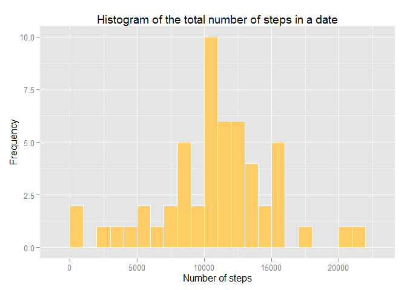
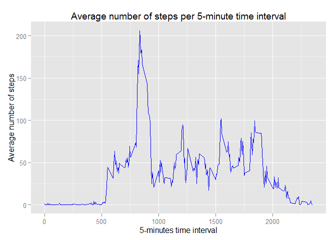
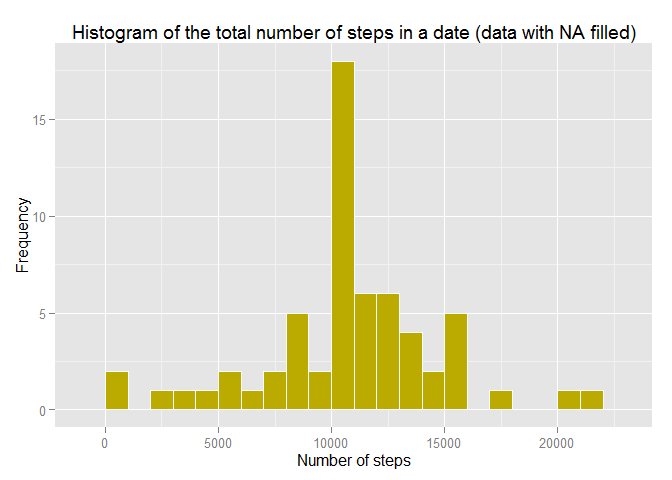
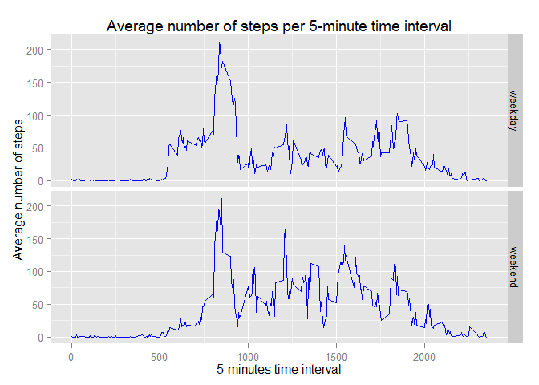

# Reproducible Research: Peer Assessment 1

First of all, load required libraries and remove warnings to avoid unwanted text in the output.

```r
options (warn=-1)
library(ggplot2)
library(plyr)
```

### Loading and preprocessing the data

First step, unzip the data and read the 'csv' file. Print a summary to have an idea about the data and, finally, reformat the date information from 'factor' to 'date' type.

```r
data <- read.csv(unzip("activity.zip"))
summary(data)
```

```
##      steps               date          interval   
##  Min.   :  0.0   2012-10-01:  288   Min.   :   0  
##  1st Qu.:  0.0   2012-10-02:  288   1st Qu.: 589  
##  Median :  0.0   2012-10-03:  288   Median :1178  
##  Mean   : 37.4   2012-10-04:  288   Mean   :1178  
##  3rd Qu.: 12.0   2012-10-05:  288   3rd Qu.:1766  
##  Max.   :806.0   2012-10-06:  288   Max.   :2355  
##  NA's   :2304    (Other)   :15840
```

```r
data$date <- as.Date(data$date, format = "%Y-%m-%d")
```

From now on, the questions included in the assigment are going to be included and answered.

### What is mean total number of steps taken per day?

1. *Make a histogram of the total number of steps taken each day*

To plot the histogram, the number of steps per date are stored in the variable 'steps_day'. As it is stated in the assignement, NA are ignored. Attributes are renamed to be meaningfull and, finally, the histogram plot is created using ggplot2.


```r
steps_day <- aggregate(data$steps, by= list(data$date), sum)
names(steps_day) <- c("date", "total_steps")
ggplot(steps_day, aes(x=total_steps)) + geom_histogram(binwidth = 1000, colour="white", fill="#FFCC66") + labs(x = "Number of steps") + labs(y = "Frequency") + labs(title = "Histogram of the total number of steps in a date")
```

 

2. *Calculate and report the mean and median total number of steps taken per day*

First, a summary is included to provide a more complete idea of the data. This summay include information regarding mean and median.


```r
summary(steps_day)
```

```
##       date             total_steps   
##  Min.   :2012-10-01   Min.   :   41  
##  1st Qu.:2012-10-16   1st Qu.: 8841  
##  Median :2012-10-31   Median :10765  
##  Mean   :2012-10-31   Mean   :10766  
##  3rd Qu.:2012-11-15   3rd Qu.:13294  
##  Max.   :2012-11-30   Max.   :21194  
##                       NA's   :8
```

```r
mean_steps_day <- mean(steps_day$total_steps, na.rm = TRUE)
median_steps_day <- median(steps_day$total_steps, na.rm = TRUE)
```

Even though, to simplify the task, the mean number of steps is 1.0766 &times; 10<sup>4</sup> and the median is 10765.

### What is the average daily activity pattern?

1. *Make a time series plot (i.e. type = "l") of the 5-minute interval (x-axis) and the average number of steps taken, averaged across all days (y-axis)*

It is important to clarify the question asked, as in the forums there has been some doubts about the meaning of the question. Rephrasing, it is asked to group data by the 5-minute time intervals, obtain the average of steps for each of the groups and plot it as a line plot.

The following R code, follows the previous steps and create the plot (using ggplot2).


```r
steps_interval <- aggregate(data$steps, by= list(data$interval), FUN=mean, na.rm=TRUE)
names(steps_interval) <- c("interval", "avg_steps")
ggplot(steps_interval, aes(x=interval, y=avg_steps)) + geom_line(colour = "#0000FF") + labs(x = "5-minutes time interval") + labs(y = "Average number of steps") + labs(title = "Average number of steps per 5-minute time interval")
```

 

2. *Which 5-minute interval, on average across all the days in the dataset, contains the maximum number of steps?*

To obtain the interval with the maximun number of steps, we proceed as follows: i) obtain the maximun number of steps and ii) subset the data to only the intervals that equals the maximun of i) 


```r
max_step <- max(steps_interval$avg_steps)
steps_interval[steps_interval$avg_steps == max_step, ]
```

```
##     interval avg_steps
## 104      835     206.2
```

### Imputing missing values

1. *Calculate and report the total number of missing values in the dataset (i.e. the total number of rows with NAs)*

As there are no NA values neither in 'date' nor 'interval' attributes, it is only neccesary to estimate the number of rows with NA in 'steps' attribute.


```r
NA_num <- nrow(data[is.na(data$steps) == TRUE, ])
```

The number of NA is 2304.

2. *Devise a strategy for filling in all of the missing values in the dataset. The strategy does not need to be sophisticated. For example, you could use the mean/median for that day, or the mean for that 5-minute interval, etc.*

3. *Create a new dataset that is equal to the original dataset but with the missing data filled in.*

To achieve the required task 2 and 3, first, a copy of 'data' called 'data_full' is created. A new attribute is included for every row filled with the average steps grouped per interval. Finally, rows without direct information of steps in 'data_full' are filled with the average value for that interval. 


```r
data_full <- data
data_full$averages <- steps_interval$avg_steps
data_full$steps[is.na(data_full$steps)] <- 
      data_full$averages[is.na(data_full$steps)]
```

4. *Make a histogram of the total number of steps taken each day and Calculate and report the mean and median total number of steps taken per day. Do these values differ from the estimates from the first part of the assignment? What is the impact of imputing missing data on the estimates of the total daily number of steps?*

Once the data have no 'NA', it is possible to create a new variable 'steps_day_full' with the sum of the steps by 'date'. The names of the variables are renamed to be meaninful. Finally, both a summary of the information and a histogram, as required by the assigment, are printed.


```r
steps_day_full <- aggregate(data_full$steps, by= list(data_full$date), sum)
names(steps_day_full) <- c("date", "total_steps")
ggplot(steps_day_full, aes(x=total_steps)) + geom_histogram(binwidth = 1000, colour="white", fill="#BBAA00") + labs(x = "Number of steps") + labs(y = "Frequency") + labs(title = "Histogram of the total number of steps in a date (data with NA filled)")
```

 

```r
summary(steps_day_full)
```

```
##       date             total_steps   
##  Min.   :2012-10-01   Min.   :   41  
##  1st Qu.:2012-10-16   1st Qu.: 9819  
##  Median :2012-10-31   Median :10766  
##  Mean   :2012-10-31   Mean   :10766  
##  3rd Qu.:2012-11-15   3rd Qu.:12811  
##  Max.   :2012-11-30   Max.   :21194
```

As it is shown in the previous plot, the distribution has changed from the original one that included NA, which is specially significan in the central value of the plot. Even though, the mean, minimum and maximum do not change, and the median almost remain the same (see 'data_full' and 'data' summaries included before). 

### Are there differences in activity patterns between weekdays and weekends?

1. *Create a new factor variable in the dataset with two levels - "weekday" and "weekend" indicating whether a given date is a weekday or weekend day.*

As required, a new factor variable 'weekday' is included with the information of the type of day of the week ('weekend' or 'weekday'). As the name of the days returned by 'weekdays()' function depend on the language of the PC, the function format has been used, as it returns numbers.


```r
data_full$weekday <- ifelse(format(data_full$date, format = "%w") %in% c(0,5), "weekend", "weekday")
```


2. *Make a panel plot containing a time series plot (i.e. type = "l") of the 5-minute interval (x-axis) and the average number of steps taken, averaged across all weekday days or weekend days (y-axis). The plot should look something like the following, which was creating using simulated data:*

To create the double plot required, the first step is create a new variable 'steps_interval_wd' grouping by 'interval' and 'weekday' and applying the mean. Its attributes are renamed to be meaninful and finally the plot is created using ggplot2.


```r
steps_interval_wd <- aggregate(data_full$steps, by= list(data_full$interval, data_full$weekday), FUN=mean, na.rm=TRUE)
names(steps_interval_wd) <- c("interval", "weekday", "avg_steps")
ggplot(steps_interval_wd, aes(x=interval, y=avg_steps)) + facet_grid(weekday ~ .) + geom_line(colour = "#0000FF") + labs(x = "5-minutes time interval") + labs(y = "Average number of steps") + labs(title = "Average number of steps per 5-minute time interval") 
```

 

As no more task are required to be included in the 'Rmd' file, the file finish here.
